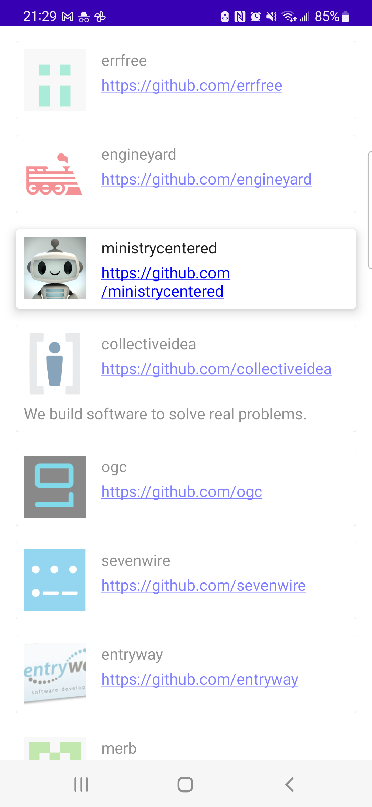
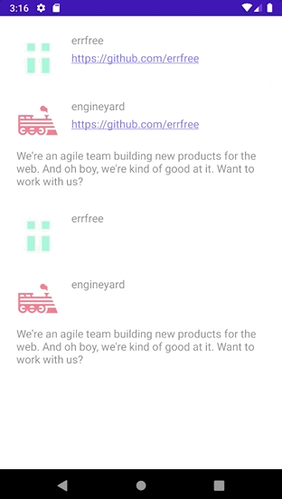

I spent about 3 ~ 4 hours on this project.

I used a simple MVP structure for this app. The presenter can be unit-tested easily.
I used Jetpack Compose for the UI and implemented pagination.
For asynchronous operations, I used RxJava.

Something I'm not 100% sure is:
- Should I use avatar_url for image? It is the only image I could find

If I have more time, I would
- add tests
- add DI
- add support for orientation change